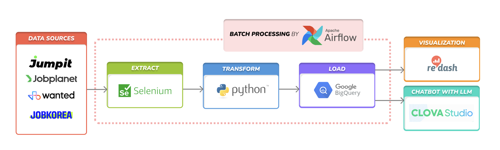
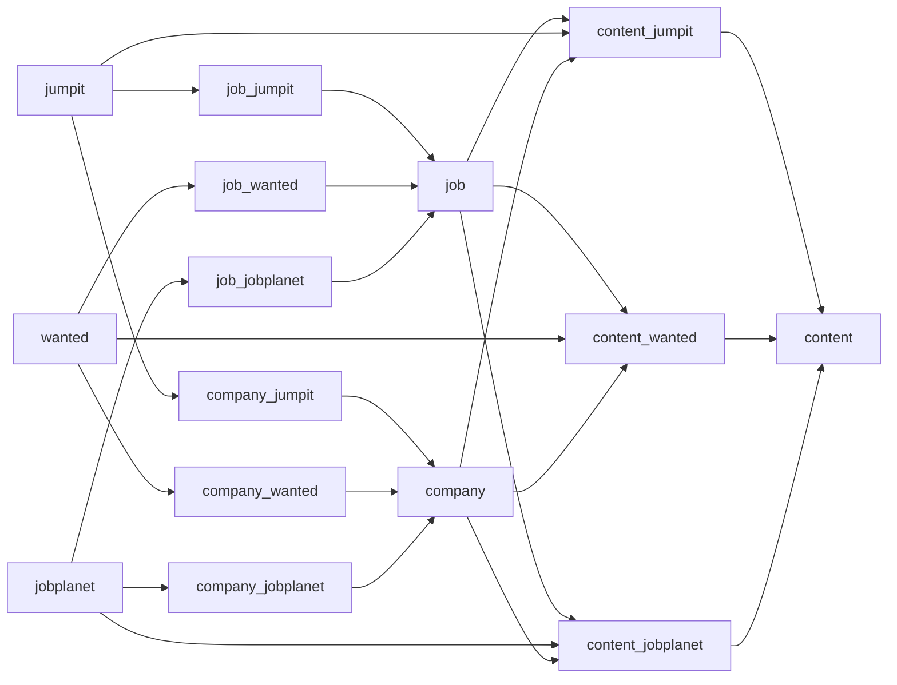
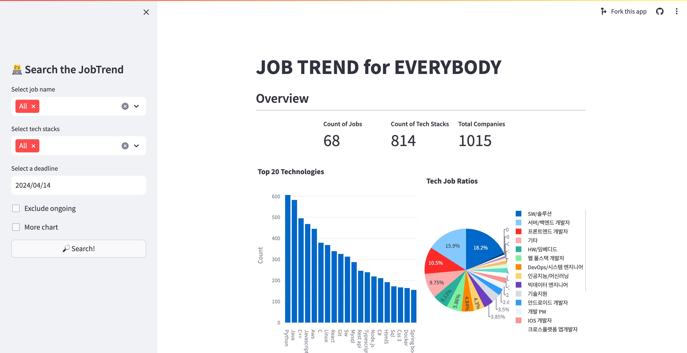
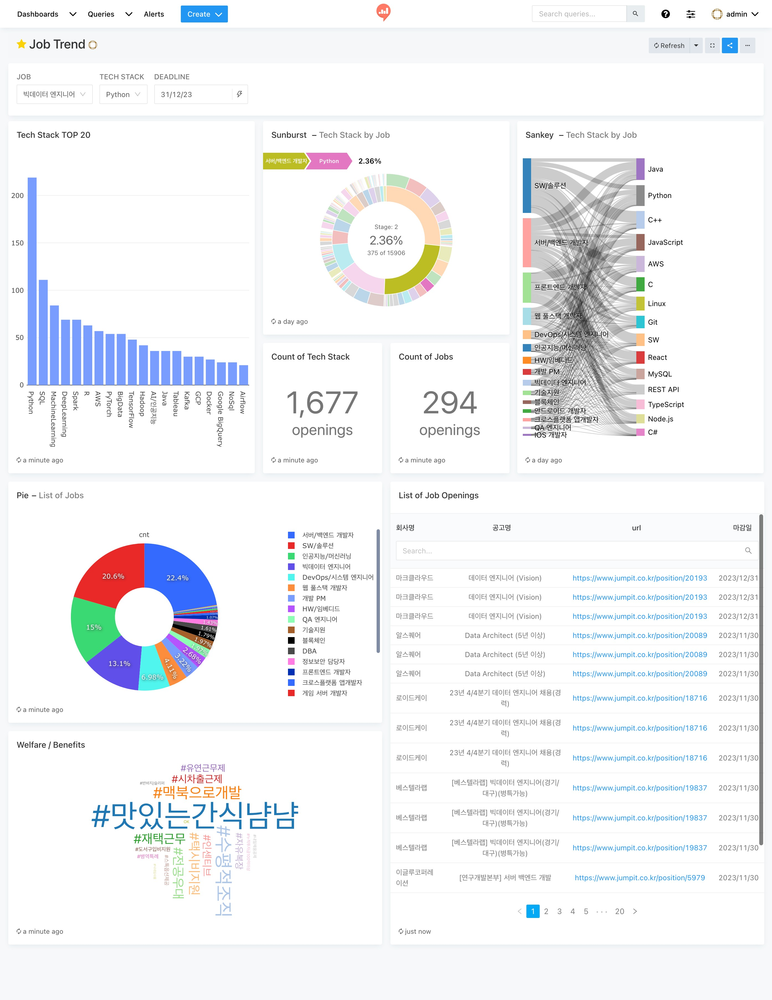

# Job Trend
개발자 채용공고 데이터 추출 파이프라인 구축 및 응용 프로젝트
(https://job-trend.streamlit.app/)

## Background
🤔 _데이터 엔지니어 직무는 어떤 기술스택이 필요할까?_<br>
🧐 _Python을 다룰 줄 알면 어떤 직무에서 일할 수 있을까?_

Job Trend 프로젝트는 이러한 궁금증에서 시작하게 되었습니다.<br>
각 채용공고 사이트 정보를 통해 개발자 직무별/기술스택별 유의미한 정보를 추출하여     
성장을 꿈꾸는 개발자들에게 도움이 되고자 합니다 🚀

## Getting Started
### _Prerequisites_
- Python 3.8
- Google Cloud Platform console - BigQuery
- dbt(data build tool)
- Streamlit (or Redash)

### _Setup_
```bash
./initialize.sh
```
### _Run_
```
./run.sh
```

## Architecture


### _Data Sources_
- 여러 채용공고 사이트들로부터 개발자 채용공고 정보를 추출합니다.
  - [x] 점핏 (https://www.jumpit.co.kr)
  - [x] 잡플래닛 (https://www.jobplanet.co.kr)
  - [x] 원티드 (https://www.wanted.co.kr)
  - [ ] ...

### _Extract_
- `Selenium`을 이용하여 동적 크롤링을 진행합니다.
- 직무별 채용공고 url을 추출한 뒤, 각 url에 접근하여 page source를 추출합니다.

### _Load_
- 추출된 데이터를 Data Warehouse에 저장합니다.
- Data Warehouse로는 `Google BigQuery`를 이용합니다.
- 저장되는 스키마는 각 사이트별로 상이하며, 대체적으로 아래와 같은 필드를 지니고 있습니다.
    - 공고 제목
    - 회사명
    - 직무
    - 기술스택
    - 마감일
    - 복지 및 혜택
    - ...

### _Transform_
- dbt(data build tool)을 이용하여 아래와 같은 프로세스로 각 사이트 채용공고별 정보를 통합시킵니다.


### _Batch Processing_
- `Airflow`를 통해 기반으로 일별 batch processing을 통해 데이터를 업데이트 합니다.
- `Terraform` 및 `Ansible`을 이용하여 k8s 기반의 환경에서 Airflow를 구동시킵니다.

### _Chatbot with LLM_
- Gemini를 기반으로 추출된 채용공고 내용을 LLM에 학습시킨 뒤, 개발자 채용과 관련된 내용을 답할 수 있는 챗봇을 생성합니다. 

### _Visualization_
- `Streamlit`을 기반으로 직무별 채용공고 및 상위 기술스택, 기술스택별 상위 직무를 시각화합니다.
- 필터링을 기반으로 원하는 직무 및 기술스택, 공고 마감기한에 대한 정보를 얻을 수 있습니다.
  

<details><summary>Redash (deprecated)</summary>

- `Redash`를 통해 SQL문을 기반으로 대시보드를 생성합니다.
- 직무별 상위 기술스택 및 기술스택별 상위 직무 등의 정보를 Bar 및 Pie chart 뿐만 아니라, Sankey 및 Sunburst Sequence chart 등을 통해 제공합니다. 
- 직무(JOB), 기술스택(TECH STACK), 마감일(DEADLINE) parameter를 통해 동적으로 반응하는 대시보드를 구현합니다.
  

</details>
