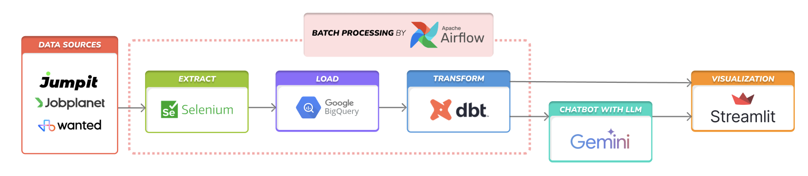

# Job Trend

채용공고 데이터 추출 파이프라인 구축 및 트렌드 분석

## Architecture



1. Crawling (Extract & Transform)
   - 대상: 채용 사이트(점핏, 잡플래닛, 원티드, 잡코리아 등) 별 채용공고 세부 페이지 
   - selenium 기반 crawling 진행
   - 채용공고별 직무, 회사명, 기술스택, 마감일 등 추출
2. Data Warehouse (Load)
   - Google BigQuery 이용
   - Airflow 기반으로 일별 batch process 기반 데이터 적재
3. Visualization
   - redash 이용 (SQL문 기반 대시보드 생성)
   
4. LLM training (future work)
   - NAVER cloud platform에서 제공하는 CLOVA Studio API 이용
   - 추출된 채용공고 정보 학습된 chatbot 생성

## Installation
```bash
./initialize.sh
```

## Run
```bash
./run.sh
```
